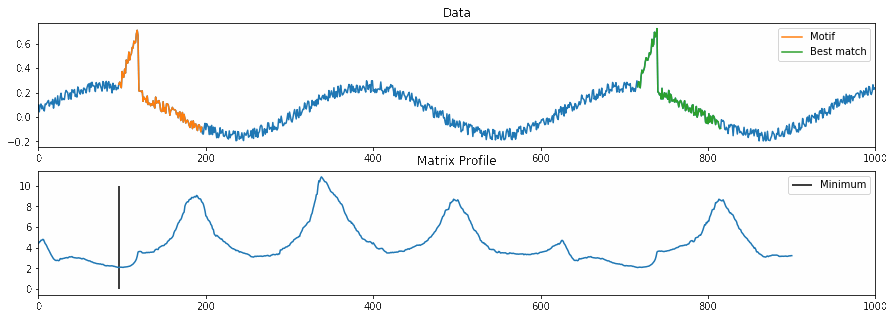

# Series Distance Matrix 

This is a Python 3 library for performing (time) series analysis
using the Series Distance Matrix,
a framework that bundles various [Matrix Profile](https://www.cs.ucr.edu/~eamonn/MatrixProfile.html)
related techniques.
These techniques can be used for answering questions relating
to pattern similarity in series.
Some example applications include:
- finding motifs in series (finding the best matching windows)
- finding discords in series (finding the worst matching windows)
- finding repetitions in series
- visualizing series
- finding changing patterns
- ...

The **Series Distance Matrix** is a generalization of the Matrix Profile 
that splits the generation and consumption of
the all-pair subsequence distances,
putting the focus on the distance matrix itself.
This allows for easier and more flexible experiments by
freely combining components and eliminates the need
to re-implement algorithms to combine techniques in an efficient way.


Following core techniques are implemented:
- Z-normalized Euclidean distance (including noise elimination)
- Euclidean distance
- (Left/Right) Matrix Profile
- Multidimensional Matrix Profile
- Contextual Matrix Profile
- Radius Profile
- Streaming and batch calculation


Following Matrix Profile related techniques are implemented:
- Valmod: find the top-1 motif in a series for each subsequence length in a given range
- Ostinato: find the top-1 (k of n) consensus motif in a collection of series
- Anytime Ostinato: find the radius profile for a collection of series


When using this library for academic purposes, please cite:
```
@article{series_distance_matrix,
title = "A generalized matrix profile framework with support for contextual series analysis",
journal = "Engineering Applications of Artificial Intelligence",
volume = "90",
pages = "103487",
year = "2020",
issn = "0952-1976",
doi = "https://doi.org/10.1016/j.engappai.2020.103487",
url = "http://www.sciencedirect.com/science/article/pii/S0952197620300087",
author = "Dieter De Paepe and Sander Vanden Hautte and Bram Steenwinckel and Filip De Turck and Femke Ongenae and Olivier Janssens and Sofie Van Hoecke"
}
```

## Installing

This library is not yet in pip, please clone this repositor and run:

```commandline
python setup.py clean build install
```

or for development (this creates a link to the source code, rather than a library):
```commandline
python setup.py develop
```


## Usage

The basic workflow goes as follows:
- You have one or two one- or multi-channel time series (num_channels x num_measurements).
When using two time series, the number of channels should match.
- You select *generators* to process a single dimension. Generators know how to create
the distance matrix for the time series.
- You select *consumers* to handle the output of generators, some consumers work on
a single output, some can work on multiple outputs. The main goal of consumers is
to keep track of relevant info in the distance matrix in an efficient way.
- You create a *calculator* and specify how much of the data you want processed,
when completed, output is available in the consumers.


### Example

```python
%matplotlib inline

# Imports
import numpy as np
import matplotlib.pyplot as plt

from distancematrix.generator.znorm_euclidean import ZNormEuclidean  # Generators live in the generator package
from distancematrix.consumer.matrix_profile_lr import MatrixProfileLR  # Consumers live in the consumer package
from distancematrix.calculator import AnytimeCalculator

# Create a one-dimensional series with 2 artefacts
data = np.array([
    np.sin(np.linspace(0,20,1000))*0.2 + np.random.rand(1000) * 0.1
])

data[0, 100:120] += np.linspace(0.1, 0.5, 20)
data[0, 720:740] += np.linspace(0.1, 0.5, 20)

plt.plot(data[0])
plt.show()

# Setup generator, consumer and calculator
m = 100  # Subsequence length

calc = AnytimeCalculator(m, data)  # One series passed => self-join

gen_0 = calc.add_generator(0, ZNormEuclidean(noise_std=0.))  # Generator 0 works on channel 0
cons_0 = calc.add_consumer([0], MatrixProfileLR())  # Consumer 0 works on generator 0

# Calculate
calc.calculate_diagonals(print_progress=True, partial=1.)

# Admire the results
min_idx = np.argmin(cons_0.matrix_profile())
match_idx = cons_0.profile_index()[min_idx]

plt.figure(figsize=(15,5))

plt.subplot(2, 1, 1)
plt.title("Data")
plt.plot(data[0])
plt.plot(range(min_idx, min_idx+m), data[0, min_idx : min_idx + m], label = "Motif")
plt.plot(range(match_idx, match_idx+m), data[0, match_idx:match_idx+m], label="Best match")
plt.gca().set_xlim((0, data.shape[1]))
plt.legend()

plt.subplot(2, 1, 2)
plt.title("Matrix Profile")
plt.plot(cons_0.matrix_profile())
plt.vlines(min_idx, 0, 10, label="Minimum")
plt.gca().set_xlim((0, data.shape[1]))
plt.legend()

plt.show()
```


